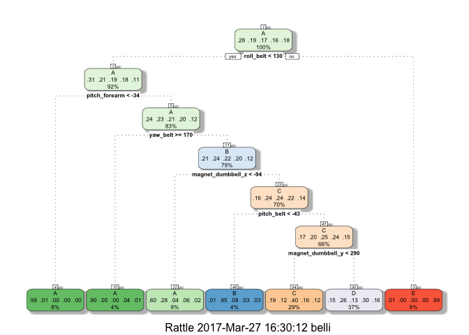
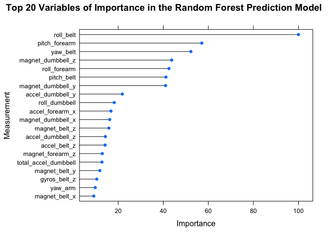

# Analysis of Accelerometer Data to Predict Quality of Barbell Lifts
E. Belli  
March 2017  


# Overview

This report analyzes data from personal activity devices on 6 participants performing barbell lifts to develop a model for predicting how well they performed the exercise.  The source of the data for this analysis comes from http://groupware.les.inf.puc-rio.br/har.  It includes measurements from accelerometers on the belt, forearm, arm, and dumbbell of the 6 participants as they performed the exercise correctly and incorrectly in 5 different ways in terms of quality, as identified by the "classe" variable.  Various prediction models, including trees and boosting, are developed based on a subset of the training data and cross-validated. The in and out-of-sample accuracies are compared and a final best prediction model is reported.

# Obtain and Examine the Raw Data

Load necessary libraries for the analysis.

```r
library(data.table); library(caret); library(rattle); library(rpart.plot); library(randomForest)
```

Download the raw data.

```r
alltrainUrl <- "http://d396qusza40orc.cloudfront.net/predmachlearn/pml-training.csv"
alltestUrl <- "http://d396qusza40orc.cloudfront.net/predmachlearn/pml-testing.csv"
alltraining <- fread(alltrainUrl, na.strings = c("NA", ""))
alltesting <- fread(alltestUrl, na.strings = c("NA", ""))
```

The training data has the following dimensions:

```r
dim(alltraining)
```

```
## [1] 19622   160
```


```r
unique(alltraining$classe)
```

```
## [1] "A" "B" "C" "D" "E"
```

There are 5 classes (A,B,C,D,E) that describe the quality of the exercises performed. A model will be developed a to predict these classification categories based on the measurement data in the data sets.

# Preprocess the data to determine good features

The relevant data contains measurements from accelerometers on the belt, forearm, arm, and dumbbell of the 6 participants.  Identify parameters in the data set which are irrelevant to this data.

```r
id_irr <- grep("belt|forearm|arm|dumbbell|classe",names(alltraining),ignore.case=TRUE,invert=TRUE); names(alltraining)[id_irr]
```

```
## [1] "V1"                   "user_name"            "raw_timestamp_part_1"
## [4] "raw_timestamp_part_2" "cvtd_timestamp"       "new_window"          
## [7] "num_window"
```
Remove these 7 columns as these are irrelevant for the prediction of quality of barbell lifts.

```r
sub1 <- subset(alltraining,select=-id_irr)
```
In addition, remove columns with mostly NA's (90% or more), as this is not useful for prediction.

```r
subtraining <- subset(sub1, select=colMeans(is.na(sub1)) < 0.90)
names(subtraining)
```

```
##  [1] "roll_belt"            "pitch_belt"           "yaw_belt"            
##  [4] "total_accel_belt"     "gyros_belt_x"         "gyros_belt_y"        
##  [7] "gyros_belt_z"         "accel_belt_x"         "accel_belt_y"        
## [10] "accel_belt_z"         "magnet_belt_x"        "magnet_belt_y"       
## [13] "magnet_belt_z"        "roll_arm"             "pitch_arm"           
## [16] "yaw_arm"              "total_accel_arm"      "gyros_arm_x"         
## [19] "gyros_arm_y"          "gyros_arm_z"          "accel_arm_x"         
## [22] "accel_arm_y"          "accel_arm_z"          "magnet_arm_x"        
## [25] "magnet_arm_y"         "magnet_arm_z"         "roll_dumbbell"       
## [28] "pitch_dumbbell"       "yaw_dumbbell"         "total_accel_dumbbell"
## [31] "gyros_dumbbell_x"     "gyros_dumbbell_y"     "gyros_dumbbell_z"    
## [34] "accel_dumbbell_x"     "accel_dumbbell_y"     "accel_dumbbell_z"    
## [37] "magnet_dumbbell_x"    "magnet_dumbbell_y"    "magnet_dumbbell_z"   
## [40] "roll_forearm"         "pitch_forearm"        "yaw_forearm"         
## [43] "total_accel_forearm"  "gyros_forearm_x"      "gyros_forearm_y"     
## [46] "gyros_forearm_z"      "accel_forearm_x"      "accel_forearm_y"     
## [49] "accel_forearm_z"      "magnet_forearm_x"     "magnet_forearm_y"    
## [52] "magnet_forearm_z"     "classe"
```
Finally, check for near-zero covariates.

```r
nzdat <- nearZeroVar(subtraining,saveMetrics=TRUE)
row.names(nzdat[nzdat$nzv==T,])
```

```
## character(0)
```

# Create training and testing sets

Create training and testing sets for developing the model by partitioning the training data into 60% for training the model and 40% for testing the models to estimate the out-of-sample accuracy and determine the best model.  The complete raw testing data will be used for the final prediction using the best model.

```r
set.seed(123)
inTrain <- createDataPartition(subtraining$classe, p = 0.6,list=FALSE)
training <- subtraining[ inTrain,]
testing  <- subtraining[-inTrain,]
print(dim(training))
```

```
## [1] 11776    53
```

```r
print(dim(testing))
```

```
## [1] 7846   53
```

# Train and evaluate the prediction models

Various prediction models are developed with 52 predictors and with the quality of lift performed ("classe") as the outcome.  The 60% subset of the training data is used to train the models and evaluate the in-sample accuracy, while the 40% subset of the training data is used as a single cross-validation test to estimate the expected out-of-sample accuracy.  The four prediction model bases tried are 1) a classification tree, 2) linear discriminant analysis, 3) generalized boosted regression, and 4) random forest.

Note that for the generalized boosted regression model and random forest model the resampling method is modified to improve computational efficiency. To improve the computational performance of the caret train function for these methods, use a parallel implementation with recommended train control settings as documented at this website: 
https://github.com/lgreski/datasciencectacontent/blob/master/markdown/pml-randomForestPerformance.md  
Specifically, the resampling method is changed from the default of bootstrapping to k-fold cross-validation, with k=10.  Note that this change results in potentially reduced model accuracy but gives a significant improvement in computational feasibility.

## Classification tree


```r
modFit_ctree <- train(classe ~ ., data=training, method="rpart")
fancyRpartPlot(modFit_ctree$finalModel)
```

<!-- -->

Compute the in-sample and out-of-sample accuracies.


```r
pred_out_ctree <- predict(modFit_ctree,newdata=testing)
out_acc_ctree <- confusionMatrix(pred_out_ctree,testing$classe)$overall[1]
pred_in_ctree <- predict(modFit_ctree,newdata=training)
in_acc_ctree <- confusionMatrix(pred_in_ctree,training$classe)$overall[1]
```

### Linear discriminant analysis


```r
modFit_lda <- train(classe ~ ., data=training, method="lda")
pred_out_lda <- predict(modFit_lda,newdata=testing)
out_acc_lda <- confusionMatrix(pred_out_lda,testing$classe)$overall[1]
pred_in_lda <- predict(modFit_lda,newdata=training)
in_acc_lda <- confusionMatrix(pred_in_lda,training$classe)$overall[1]
```

## Generalized boosted regression


```r
library(parallel); library(doParallel)
cluster <- makeCluster(detectCores()-1)
registerDoParallel(cluster)
fitControl <- trainControl(method="cv",number=10,allowParallel=TRUE)
modFit_gbm <- train(classe ~ ., data=training, method="gbm",verbose=FALSE)
stopCluster(cluster)
registerDoSEQ()
pred_out_gbm <- predict(modFit_gbm,newdata=testing)
out_acc_gbm <- confusionMatrix(pred_out_gbm,testing$classe)$overall[1]
pred_in_gbm <- predict(modFit_gbm,newdata=training)
in_acc_gbm <- confusionMatrix(pred_in_gbm,training$classe)$overall[1]
```

## Random Forest


```r
library(parallel); library(doParallel)
cluster <- makeCluster(detectCores()-1)
registerDoParallel(cluster)
fitControl <- trainControl(method="cv",number=10,allowParallel=TRUE)
modFit_rf <- train(classe ~ ., data=training, method="rf",trControl=fitControl)
stopCluster(cluster)
registerDoSEQ()
pred_out_rf <- predict(modFit_rf,newdata=testing)
out_acc_rf <- confusionMatrix(pred_out_rf,testing$classe)$overall[1]
pred_in_rf <- predict(modFit_rf,newdata=training)
in_acc_rf <- confusionMatrix(pred_in_rf,training$classe)$overall[1]
```

## Summary of the prediction models

A summary of the in-sample and out-of-sample accuracies for the prediction models is given below.


```r
c1 <- c(in_acc_ctree,in_acc_lda,in_acc_gbm,in_acc_rf)
c2 <- c(out_acc_ctree,out_acc_lda,out_acc_gbm,out_acc_rf)
df <- data.frame(c1,c2)
colnames(df) <- c("in-sample accuracy","out-of-sample accuracy")
rownames(df) <- c("C Tree", "LDA","GBM","RF")
df
```

```
##        in-sample accuracy out-of-sample accuracy
## C Tree          0.5193614              0.5068825
## LDA             0.7066916              0.7055825
## GBM             0.9741848              0.9631659
## RF              1.0000000              0.9913332
```

For all of the models, the estimated out-of-sample accuracy is not much different from the in-sample accuracy.  Not surprisingly, the two simplest models, i.e. the classification tree and linear discriminant analysis, are the least accurate.
The classification tree is the least accurate model of the four, with just 50% accuracy.  Linear discriminant analysis provides much improvement, with about a 70% accuracy rate, even though it is a linear-based model and assumes the data follows a multivariate Gaussian probaalistic model.  However, the model is still not accurate enough for good prediction.  Despite the resampling with k-fold cross-validation rather than boosting, both generalized boosted regression and random forest perform very well.  The random forest model is the most accuracte model.  It has an in-sample accuracy of 100%, though this may suggest over-fitting.  It has a high out-of-sample accuracy of > 99%.  So this is our best-fit model. Examine the accuracy by  classification of quality of exercise.


```r
out_rf <- confusionMatrix(pred_out_rf,testing$classe)
out_rf$byClass[,"Balanced Accuracy"]
```

```
##  Class: A  Class: B  Class: C  Class: D  Class: E 
## 0.9980352 0.9937027 0.9899523 0.9920946 0.9968793
```

The model is most accurate for predicting Class A quality exercise performance and least accurate for predicting Class C quality.

To examine the radom forest model further, determine the variables of most importance in the model.

```r
plot(varImp(modFit_rf), top = 20,xlab="Importance",ylab="Measurement",main="Top 20 Variables of Importance in the Random Forest Prediction Model")
```

<!-- -->

The roll accelerometer measuement from the belt a sigificantly more influential predictor on the model than the other variables.

## Use the best model to predict exercise quality for the test data

Now that the best model has been cross-validated, use the random forest model with the orginal test data to make a prediction of exercise quality.


```r
predict(modFit_rf,newdata=alltesting)
```

```
##  [1] B A B A A E D B A A B C B A E E A B B B
## Levels: A B C D E
```
